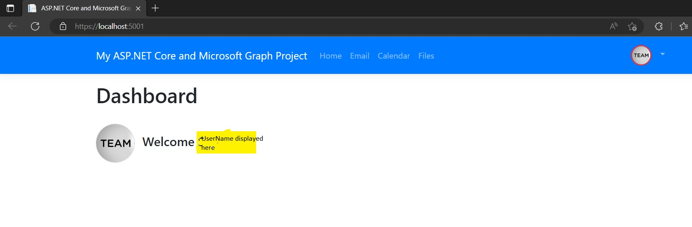
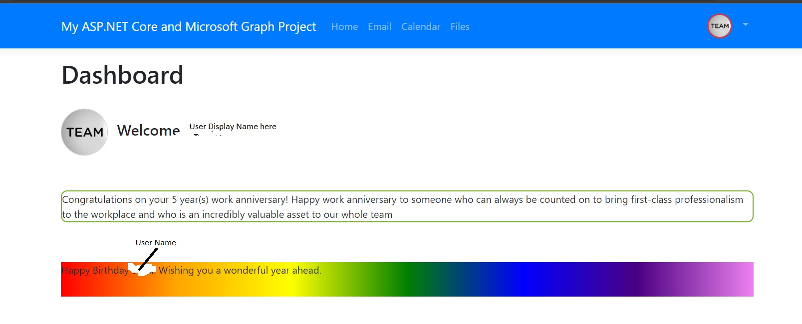
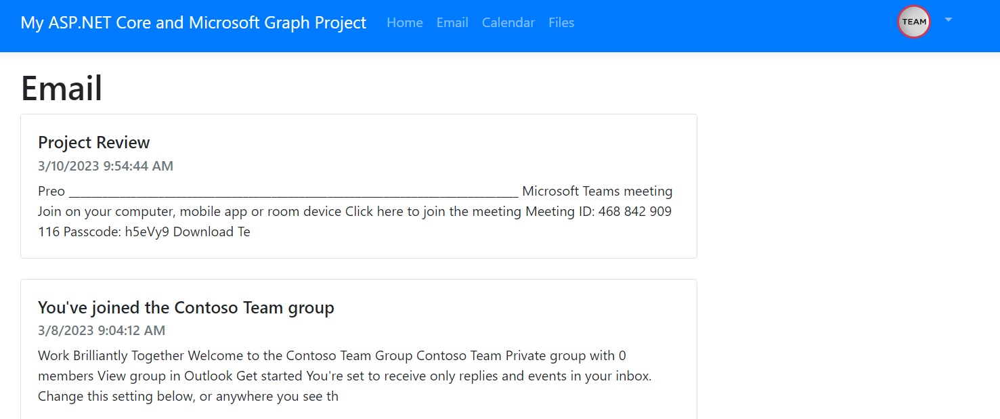
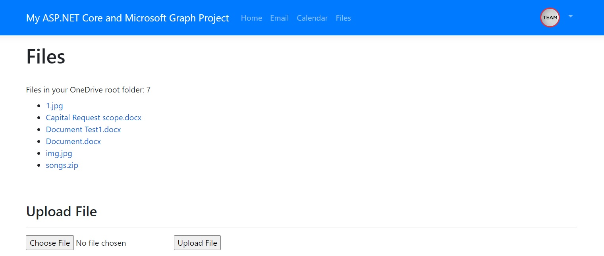
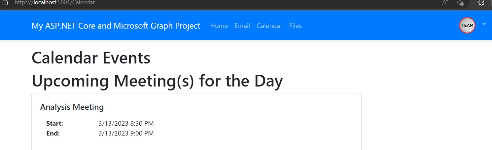
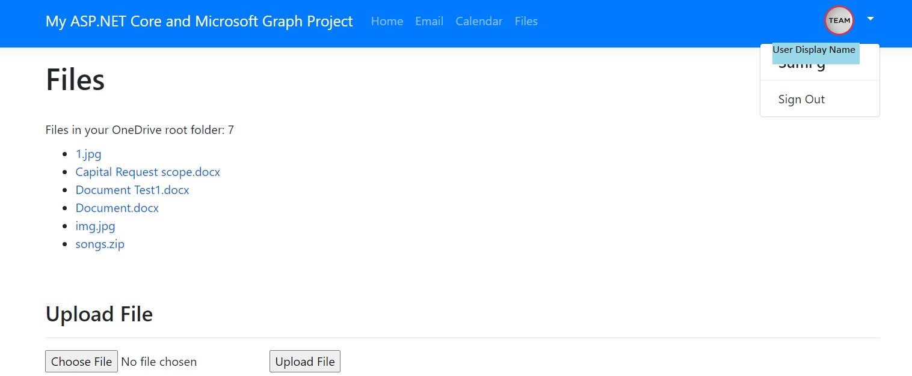

# GraphAPIDashboard

Microsoft Graph API  &  .Net Framework:
.Net SDK and Microsoft Graph API drives the app. The app displays the unread emails, upcoming meetings for the day, upload or download files from the OneDrive.
App also in the home page, it displays wishes on Hired Date and on birthday of the user.

## What the project does?
*	Once you're logged in you should see your user name displayed with the profile photo

*	If the user’s birthday is the current day, Birthday wish message will be displayed.
*	If the user’s hired date is the current day, Congratulation message will be displayed.

*	Under the Email section –Unread mails will be displayed

*	Under the Files section- one drive files if available will be displayed and also with an option to upload

*	Under the Calendar section- upcoming meetings for the day will be displayed. 

*	Sign Out option is provided in the top right corner in the dropdown.

*	Click on the menu items at the top to view the user's email, calendar, and files 
(you may need to add mail messages, calendar events, and files for the user if you don't see any data).

## How users can get started with the project
1.	Ensure you have .NET 6 installed on your machine. You can download and install it from the following link:
https://dot.net
2.	Create a Microsoft 365 developer tenant if you don't already have one:
https://developer.microsoft.com/microsoft-365/dev-program
3.	Register a new app in Azure Active Directory:

		*	Login to the Azure Portal.
		*	Select Azure Active Directory.
		*	Select App registrations in the Manage section.
		*	Select New registration in the toolbar.
		*	Give the app a name.
		*	Select Accounts in any organizational directory (Any Azure AD directory - Multitenant) in the Supported account types.
		*	In the Redirect URI section select Web and enter the following URL:
	    			https://localhost:5001
		*	After the app registration is created, note the client ID value shown (you'll use it later) .
		*	Click the Authentication option on the left.
		*	Add the following URL into the Web section's Redirect URIs:
		        https://localhost:5001/signin-oidc
		*	Add the following URL into the Front-channel logout URL section:
		        	https://localhost:5001:signout-oidc
		*	Check the ID tokens checkbox.Save your changes.
		*	Click Certificates & secrets and create a new client secret. Ensure that you copy and store the 
		        secret somewhere since this is the only time you'll be able to access it. You'll need it in the next step.
			
4.       Open a terminal window at the root of the End folder and run the following commands, substituting YOUR_APP_ID with your Application (client) ID from the Azure portal, and YOUR_APP_SECRET with the application secret you created.

		dotnet user-secrets init 
		dotnet user-secrets set "AzureAd:ClientId" "YOUR_APP_ID" 
		dotnet user-secrets set "AzureAd:ClientSecret" "YOUR_APP_SECRET"
		Run dotnet restore
		Run dotnet build
		Run dotnet run
5.	Once the app is running, navigate to https://localhost:5001 and login using one of your Microsoft 365 tenant users.

NOTE: If you get an SSL certificate error, you can generate a dev certificate for your machine using the following command:
dotnet dev-certs https -t

